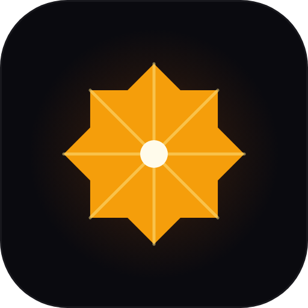

# Mohammad Sajid Ansari

### Senior Full-Stack Developer · Indie maker behind [Idara Studio](https://idara.studio)

Building small, single-purpose WordPress blocks — and the Next.js sites around them. 
One plugin, one purpose. No bloat, no tracking. From Surat, India. 🇮🇳

---

### 🔭 What I'm building

**[Idara Studio](https://idara.studio)** — a one-person plugin studio crafting focused, lightweight Gutenberg blocks. *"The studio that lights up your editor."*

- 🟢 **[Idara Reading Time](https://wordpress.org/plugins/idara-reading-time/)** — estimated reading time with an optional scroll progress bar. Live on WordPress.org · FSE-ready · under 25&nbsp;KB · loads only where used.
- 🔜 **Business Hours · Notice Block · Author Bio** — single-purpose blocks shipping through 2026.

**Beyond the studio**

- 🎮 **S8UL Global Digital HQ** — a Next.js 15 esports portal (BGMI / EWC 2026 data).

---

### 🧰 Tech I actually use

---

### 📊 GitHub

---

### 📫 Reach me

- 🌐 **[idara.studio](https://idara.studio)**
- 🧩 **WordPress.org** — [@sajidansari65](https://profiles.wordpress.org/sajidansari65/)
- ✉️ **sajidansari0605@gmail.com**

إدارة — the studio that lights up your editor.

